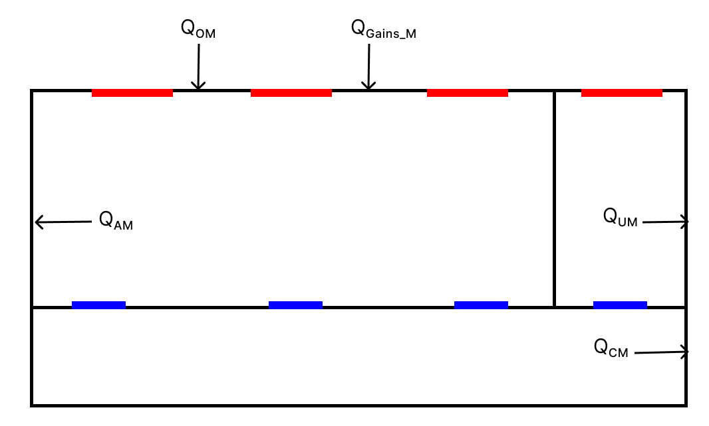

This document provides the technical support manual for the multi-family apartment building model.

# Apartment Technical Document

# Table of Contents

- [Apartment Technical Document](#apartment-technical-document)
- [Table of Contents](#table-of-contents)
- [Overview](#overview)
- [Parameters](#parameters)
  - [Model Parameters](#model-parameters)
  - [Building Parameters](#building-parameters)
  - [Core Parameters](#core-parameters)
  - [Parking Parameters](#parking-parameters)
  - [Power Parameters](#power-parameters)
  - [System Parameters](#system-parameters)
  - [Unit Parameters](#unit-parameters)
  - [Vacant Unit Parameters](#vacant-unit-parameters)
- [Thermal Model](#thermal-model)
  - [System Floor Plan](#system-floor-plan)
  - [Variables](#variables)
    - [Zone](#zone)
    - [Building Design](#building-design)
    - [Building Derived Properties](#building-derived-properties)
  - [System Diagrams](#system-diagrams)
    - [Configurations](#configurations)
      - [Inside and One Side](#inside-and-one-side)
      - [Outside and One Side](#outside-and-one-side)
      - [Inside and Both Sides](#inside-and-both-sides)
      - [Outside and Both Sides](#outside-and-both-sides)
  - [System Gains](#system-gains)
    - [Heat gain zones](#heat-gain-zones)
    - [Occupied Apartment](#occupied-apartment)
    - [Unoccupied Apartment](#unoccupied-apartment)
    - [Building Core](#building-core)
    - [Building Mass](#building-mass)
  - [HVAC Controls](#hvac-controls)
    - [System modes](#system-modes)
  - [Thermal Parameters](#thermal-parameters)
    - [Building Thermal Properties](#building-thermal-properties)
    - [Capacitance](#capacitance)
    - [Conductance](#conductance)
  - [Energy Balance](#energy-balance)
  - [Heating/Cooling Solution Method](#heatingcooling-solution-method)
    - [Step 1 - Determine the system mode](#step-1---determine-the-system-mode)
    - [Step 2 - Compute the equilibrium load](#step-2---compute-the-equilibrium-load)
    - [Step 3 - Constrain the heat gain/loss](#step-3---constrain-the-heat-gainloss)
    - [Step 4 - Compute the equilibrium temperature](#step-4---compute-the-equilibrium-temperature)
    - [Step 5 - Compute the zone temperature changes](#step-5---compute-the-zone-temperature-changes)
- [Heating/Cooling Design Conditions](#heatingcooling-design-conditions)
  - [Unit Capacity](#unit-capacity)
  - [System Capacity](#system-capacity)
- [Electric Power Demand](#electric-power-demand)

# Overview

The apartment building model in GridLAB-D represents multi-storey, multi-tenant residential buildings. The building must have more than 1 floor and more than 1 unit. The building may have partial occupancy, and the vacant units are assumed to have not end-use loads with minimal space conditioning.

Circulation zones may be outdoor, or indoor with or without space conditioning. If indoor, the circulation zone may have units on only one or on both sides. Circulation is assumed to be linear, and ending at the perimeter walls.

The building may be equipped with central heating and/or cooling, using a forced air, two-pipe, or four-pipe system. Apartment units may also have independent heating, cooling, and ventilation.

# Parameters

## Model Parameters

The building model parameters are grouped into the following categories.

- `building`: Parameters relating to the entire building.
- `core`: Parameters relating to the building core.
- `parking`: Parameters relating to the parking structure (if any).
- `power`: Parameters relating to the electric power systems.
- `system`: Parameters relating to the building systems.
- `unit`: Parameters relating to the apartment units.
- `vacant`: Paremeters relating to the vacant units.

## Building Parameters

- `building_floors`: (static integer) The number of floors in the building. This value must be greater than 1. This value has no default and must be specified in the model.

- `building_floor_depth[ft]`: (static real) The ceiling-to-floor depth in the building (i.e., floor thickness). The default is `2.0 ft`.

- `building_floor_height[ft]`: (static real) The floor-to-ceiling height in the building (i.e., unit height). The default is `8.0 ft`.

- `building_heat_leakage[pu]`: (static real) The fraction of zone heat gains that leak into the mass. The default is `0.1 pu`.

- `building_occupancy_factor[pu]`: (static real) The fraction of building units that are occupied. The default is `0.9 pu`.

- `building_outdoor_temperature[degF]`: (input real) The temperature outside the building (driven by the weather model). The default is `59.0 degF`.

- `building_overdesign_factor[pu]`: (static real) The amount by which the building systems are overdesigned. The default of `0.5 pu`.

- `building_units`: (static integer) The number of units in the building. This value has no default and must be specified in the model.

## Core Parameters

- `core_configuration`: (static set) Indicates the configuration of the core. The default is `NONE`. Options include:

  - `NONE`: The core is exterior, single-loaded, and unconditioned.
  - `INDOOR`: The core space is indoor.
  - `DOUBLE`: The core is double-loaded. This parameter implies `INDOOR`.
  - `CONDITIONED`: The core space is conditioned. This parameter implies `INDOOR`.

- `core_cooling_setpoint[degF]`: (input real) The cooling setpoint in the core space. The value is only meaningful if the core is an indoor conditioned space. The default is `unit_cooling_setpoint+5.0`.

- `core_elevators`: (static integer) The number of elevators operating in the core space. The default is `0`.

- `core_heating_setpoint[degF]`: (input real) The heating setpoint in the core space. The value is only meaningful if the core is an indoor conditioned space. The default is `unit_heating_setpoint-5.0`.

- `core_laundry_units`: (static integer) The number of community/shared washer/dryers pairs installed in the core space.

- `core_mode`: (static enumeration) The operating mode of the core zone. The default `OFF`. Valid values are:
  - `OFF`: The system is off.
  - `VENTILATING`: The system is ventilating.
  - `HEATING`: The system is heating.
  - `COOLING`: The system is cooling.
- `core_width[ft]`: (static real) The width of the core space. The default is `5 ft` for single-loaded corridors, and `6 ft` for double-loaded corridors.

## Parking Parameters

- `parking_capacity_chargers[kW]`: (static real) The installed vehicle charger capacity. The default is `0.0 kW`.

- `parking_capacity_elevators[kW]`: (static real) The installed elevator capacity. The default is `0.0 kW`.

- `parking_capacity_lights[kW]`: (static real) The installed lighting capacity. The default is `0.0 kW`.

- `parking_capacity_ventilation[kW]`: (static real) The installed ventilation capacity. The default is `0.0 kW`.

- `parking_chargers_active`: (input integer) The number of EV chargers that are in use. The default is `0`.

- `parking_chargers_installed`: (static integer) The number of EV chargers installed. The default is `0`.

- `parking_configuration`: (static enumeration) The parking configuration. The default is `OUTDOOR`. The following options are recognized:

  - `OUTDOOR`: The parking is exterior (lighting is on only at night).
  - `INDOOR`: The parking in indoor (lighting and ventilation are always on).

- `parking_demand_chargers[pu]`: (output real) The parking EV charger demand as a fraction of installed capacity. The default is `0.0`.

- `parking_demand_elevators[pu]`: (output real) The parking elevator demand as a fraction of installed capacity. The default is `0.0`.

- `parking_demand_lights[pu]`: (output real) The parking lighting demand as a fraction of installed capacity. The default is `0.0`.

- `parking_demand_ventilation[pu]`: (output real) The parking ventilation demand as a fraction of installed capacity. The default is `0.0`.

- `parking_size`: (static integer) The total number of parking spots installed.

## Power Parameters

- `power_core[kW]`: (output real) The power delivered to the core spaces in the building (including washing and drying).

- `power_parking[kW]`: (output real) The power delivered to the parking areas.

- `power_system[kW]`: (output real) The power delivered to the building systems (i.e., HVAC).

- `power_total[kW]`: (output real) The total power delivered to the building, i.e., core, parking, system, and units.

- `power_units[kW]`: (output real) The total power delivered to the apartment units (both occupied and vacant).

## System Parameters

- `system_cooling_air_temperature[degF]`: (static real) The system cooling supply air temperature. This is only meaningful when `system_type_central&COOL` and `system_type_ventilation==CENTRAL`. The default value is `50 degF`.

- `system_cooling_capacity[kBtu/h]`: (static real) The system cooling capacity. This is only meaningful when `system_type_central&COOL`. The default value is computed based on the heating and cooling design conditions (see below).

- `system_cooling_efficiency[kBtu/kWh]`: (static real) The system cooling efficiency. This is only meaning when `system_type_central&COOL`. The default value is "15.0 kBtu/kWh".

- `system_heating_air_temperature[degF]`: (static real) The system heating supply air temperature. This is only meaning when `system_type_central&HEAT` and `system_type_ventliation==CENTRAL`. The default is `110 degF`.

- `system_heating_capacity[kBtu/h]`: (static real) The system heating capacity. This is only meaningful when `system_type_central&HEAT`. The default value is computed based on the heating and cooling design conditions (see below).

- `system_heating_efficiency[kBtu/kWh]`: (static real) The system heating efficiency. This is only meaning when `system_type_central&HEAT`. The default value is `10 kBtu/kWh`.

- `system_mode`: (static enumeration) The operating mode of the central system. The default `OFF`. Valid values are:

  - `OFF`: The system is off.
  - `VENTILATING`: The system is ventilating.
  - `HEATING`: The system is heating.
  - `COOLING`: The system is cooling.

- `system_type_central`: (static set) The central system type, if any. The default is `NONE`. Valid options are:

  - `NONE`: No central system is present.
  - `HEAT`: Only central heating is present.
  - `COOL`: Only central cooling is present.
  - `BOTH`: Both central heating and cooling are present. This is equivalent to `HEAT|COOL`.

- `system_type_economizer`: (static enumeration) The type of economizer used by the central cooling system, if any. The default is `NONE`. Valid options are:

  - `NONE`: No economizer present
  - `DRYBULB`: Economizer uses drybulb temperature sensor
  - `WEBBULB`: Economizer uses wetbulb temperature sensor
  - `DIFFERENTIAL`: Economizer uses differential of two wetbulb sensors.

- `system_type_ventilation`: (static enumeration) The type of central ventilation system, if any. The default is `NONE`. Valid values are:
  - `NONE`: No artificial ventilation is present
  - `LOCAL`: Local-only ventilation is present
  - `CENTRAL`: Central ventilation is present

## Unit Parameters

- `unit_appliance_types`: (static set) The types of appliances installed in the units. The default `REFRIGERATOR`. Valid values are:

  - `COOKING`: Units have cooking appliances.
  - `DISHWASHER`: Units have dishwashers.
  - `DRYER`: Units have dryers.
  - `REFRIGERATOR`: Units have refrigerators.
  - `NONE`: Units have no appliances.
  - `WASHER`: Units have washers.

- `unit_capacity_cooking[kW]`: (static double) The maximum power of the cooking appliances in units. The default is `3.0 kW`.

- `unit_capacity_dishwasher[kW]`: (static double) The maximum power of the dishwashing appliances in units. The default is `1.8 kW`.

- `unit_capacity_dryer[kW]`: (static double) The maximum power demand of dryers in units. The default is `3.0 kW`.

- `unit_capacity_lights[kW]`: (static double) The maximum lighting demand in units. The default is based on floor area, i.e., `0.6 W/sf`.

- `unit_capacity_plugs[kW]`: (static double) The maximum non-lighting plug load demand in units. The default is based on floor area, i.e., `0.5 W/sf`.

- `unit_capacity_refrigerator[kW]`: (static double) The maximum refrigeration demand in units. The default is `200 W`.

- `unit_capacity_washer[kW]`: (static double) The maximum washer power demand in units. The default is `1.0 kW`.

- `unit_cooling_capacity[kBtu/h]`: (static double) The cooling capacity of the unit systems, if any. The default is computed based on design conditions (see below).

- `unit_cooling_efficiency[kBtu/kW]`: (static double) The unit cooling system efficiency. The default is `15 kBtu/kWh`.

- `unit_cooling_setpoint[degF]`: (input double) The unit cooling system temperature setpoint. The default is `78 degF`.

- `unit_demand_cooking[pu]`: (dynamic double) The fraction of the cooking power capacity that is active. The default is set by the residential cooking schedule.

- `unit_demand_dishwasher[pu]`: (dynamic double) The fraction of the dishwasher power capacity that is active. The default is set by the residential dishwasher schedule.

- `unit_demand_dryer[pu]`: (dynamic double) The fraction of the dryer power capacity that is active. The default is set by the residential dryer schedule.

- `unit_demand_lights[pu]`: (dynamic double) The fraction of the lighting power capacity that is active. The default is set by the residential lighting schedule.

- `unit_demand_plugs[pu]`: (dynamic double) The fraction of the plugs power capacity that is active. The default is set by the residential plugs schedule.

- `unit_demand_refrigerator[pu]`: (dynamic double) The fraction of the refrigerator power capacity that is active. The default is set by the residential refrigerator schedule.

- `unit_demand_washer[pu]`: (dynamic double) The fraction of the washer power capacity that is active. The default is set by the residential washer schedule.

- `unit_depth[ft]`: (static double) The unit depth is the average distance from the core wall to the perimeter meter. The default is `40 ft`

- `unit_door_area[sf]`: (static double) The area of a unit door. The default is `20 sf`.

- `unit_heating_capacity[kBtu/h]`: (static double) The heating capacity of the unit systems, if any. The default is computed based on design conditions (see below).

- `unit_heating_efficiency[kBtu/kWh]`: (static double) The unit heating system efficiency. The default is `10 kBtu/kWh`. Note that the effectiveness of a heating decline with lower outdoor temperature, but the heating efficiency is never below `3.4 kBtu/kWh`.

- `unit_heating_setpoint[degF]`: (input double) The unit heating system temperature setpoint. The default is `70 degF`.

- `unit_mode`: (dynamic enumeration) The local system mode. The default is `OFF`. Valid values are:

  - `OFF`: The system is off.
  - `VENTILATING`: The system is ventilating.
  - `HEATING`: The system is heating.
  - `COOLING`: The system is cooling.

- `unit_system_type`: (static set) The type of unit heating/cooling systems present. The default is `NONE`. Valid options are:

  - `NONE`: No local system is present.
  - `HEAT`: Only local heating is present.
  - `COOL`: Only local cooling is present.
  - `BOTH`: Both local heating and cooling are present. This is equivalent to `HEAT|COOL` and implies the unit is a heat-pump.

- `unit_width[ft]`: (static double) The unit width is the distance from one unit interior wall to the next. The default is `25` ft.

- `unit_window_area[sf]`: (static double) The total area of a unit's window. The default is 50% of the exterior wall area.

## Vacant Unit Parameters

- `vacant_cooling_setpoint[degF]`: The vacant unit cooling setpoint. The default is `120 degF`.

- `vacant_heating_setpoint[degF]`: The vacant unit heating setpoint. The default is `50 degF`.

- `vacant_mode`: The vacant unit system mode. The default `OFF`. Valid values are:
  - `OFF`: The system is off.
  - `VENTILATING`: The system is ventilating.
  - `HEATING`: The system is heating.
  - `COOLING`: The system is cooling.

# Thermal Model

## System Floor Plan

The thermal model is a based on a four-zone ETP model, as shown in Figure 1.

<figure align="center">
    
    <figcaption>Figure 1: Detailed Apartment floor plan </figcaption>
</figure>
<!--  -->

The apartment building that is being modeled is assumed to have certain items in each zone which is reflected by the following diagrams and the table below.

|         Zone         |     Content     | Quantity |
| :------------------: | :-------------: | :------: |
|  Occupied Apartment  |      Door       |    1     |
|          -           |     Window      |    1     |
| Unoccupied Apartment |      Door       |    1     |
|          -           |     Window      |    1     |
|    Building Core     |      Door       |    1     |
|          -           |     Window      |    1     |
|          -           | Apartment Doors |    M     |

Table 1: Contents in each respective zone for thermal model

## Variables

### Zone

The following zone variables are defined:

| Zone Name            | Temperature | Mass  | Heat  |
| :------------------- | :---------: | :---: | :---: |
| Occupied apartment   |    $T_A$    | $C_A$ | $Q_A$ |
| Unoccupied apartment |    $T_U$    | $C_U$ | $Q_U$ |
| Building core        |    $T_C$    | $C_C$ | $Q_C$ |
| Building mass        |    $T_M$    | $C_M$ |   -   |
| Outdoor air          |    $T_O$    |   -   |   -   |

Table 2: Zone variables

### Building Design

The following parameters are used to compute the thermal parameters for a building.

| Parameter | Description                                          |
| :-------: | :--------------------------------------------------- |
|    $N$    | Number of floors (integer)                           |
|  $N_{A}$  | # Occupied Apartments                                |
|    $M$    | Number of units per floor (integer)                  |
|   $K_X$   | Exterior core (no=0, yes=1)                          |
|   $K_D$   | Core loading (0=one side, 1=both sides)              |
| $\omega$  | Ratio of window area to wall area                    |
|  $\beta$  | Fraction of units that are occupied out of all units |
|    $X$    | Unit width (ft)                                      |
|    $Y$    | Unit depth (ft)                                      |
|    $Z$    | Unit height (ft)                                     |
|    $W$    | Interior core width (ft)                             |
|    $F$    | Floor thickness (ft)                                 |
|    $I$    | Wall thickness (ft)                                  |
|   $A_D$   | Unit door area (sf)                                  |

Table 3: Building design parameters

### Building Derived Properties

|     Variable      |       Parameter        |                       Description                       |
| :---------------: | :--------------------: | :-----------------------------------------------------: |
|       $X_L$       | $MX(1-\frac{1}{2}K_D)$ | Length of entire building core for an entire floor (ft) |
|       $A_L$       |         $X_LZ$         |       Area of long hallway wall for building core       |
|        $A$        |         $X Y$          |                  Unit floor area (sf)                   |
|  $A_{W_{unit}}$   |      $\omega X Z$      |                  Unit window area (sf)                  |
|  $A_{W_{core}}$   |      $\omega W Z$      |             Building core window area (sf)              |
|       $A_U$       |         $Y Z$          |            Interior unit-unit wall area (sf)            |
|       $A_O$       |  $X Z - A_{W_{unit}}$  |              Exterior unit wall area (sf)               |
|       $A_C$       |       $XZ - A_D$       |            Interior unit-core wall area (sf)            |
|       $A_H$       |          $WZ$          |              Core exterior wall area (sf)               |
|    $A_{H_{W}}$    |  $A_{H}-A_{W_{core}}$  |         Core exterior wall area w/ window (sf)          |
|    $A_{H_{D}}$    |     $A_{H}-A_{D}$      |          Core exterior wall area w/ door (sf)           |
|  $A_{C_{sides}}$  |     $2NA_H(1-K_X)$     |                                                         |
| $A_{C_{aptwall}}$ |     $NA_L(K_D+1)$      |                                                         |
|   $A_{C_{ext}}$   |  $NA_L(1-K_X)(1-K_D)$  |                                                         |
|  $A_{C_{floor}}$  |        $NX_LW$         |                                                         |
| $A_{C_{ceiling}}$ |        $NX_LW$         |                                                         |

Table 4: Derived building dimension areas

<!-- |   $N_{int walls}$   |  $2NM\beta(1-\beta)$   |                                                         |
|   $N_{ext walls}$   |      $2N(K_D+1)$       |                                                         |
| $N_{OA_{extwalls}}$ |    $2N\beta(1+K_D)$    |                                                         |
| $N_{OU_{extwalls}}$ |  $2(1-\beta)(1+K_D)$   |                                                         | -->

|     Parameter      |                                                 Calculation                                                  |              Description              |
| :----------------: | :----------------------------------------------------------------------------------------------------------: | :-----------------------------------: |
|        $V$         |                                                   $X Y Z$                                                    |           Unit volumne (cf)           |
| $V_{outsidewalls}$ |                                       $2NI(A_L+A_U(K_D+1)+A_H(K_X-1))$                                       |   Total Volume of all outside walls   |
|  $V_{innerwalls}$  |                                               $NI(M-1-K_D)A_U$                                               |    Total Volume of all inner walls    |
|  $V_{unitfloors}$  |                                                    $NAF$                                                     |    Total Volume of all unit floors    |
| $V_{unitceiling}$  |                                                     $AF$                                                     |   Total Volume of all unit ceilings   |
|  $V_{corewalls}$   |                                        $NA_LI(2K_D + (1-K_D)(1-K_X))$                                        |    Total Volume of all core walls     |
|  $V_{corefloor}$   |                                                   $NX_LWF$                                                   |    Total Volume of all core floor     |
| $V_{coreceiling}$  |                                                   $X_LWF$                                                    |   Total Volume of all core ceiling    |
|  $V_{totalwalls}$  | $V_{outsidewalls}+V_{innerwalls}+V_{unitfloors}+V_{unitceiling}+V_{corewalls}+V_{corefloor}+V_{coreceiling}$ | Total Volume of all walls in building |

Table 5: Derived building dimension volumes

## System Diagrams

### Configurations

The model is flexible in which there are 4 different configurations of building types that can be modeled. The two different variables that determine the configuration are $K_D$ and $K_X$. $K_D$ determines if the model has apartments on one side ($K_D$ = 0) or both sides ($K_D$ = 1) of building core and $K_X$ which determines if the model has a building core that is inside ($K_X$ = 0) or outside ($K_X$ = 1).

All possible configurations are listed below with included diagrams for clarity and completeness.

#### Inside and One Side

<!--  -->
<figure align="center">
    
    <figcaption>Figure 2a: Apartment floor plan for inside and one side configuration</figcaption>
</figure>

<!--  -->

<figure align="center">
    
    <figcaption>Figure 2b: Apartment side profile for inside and one side configuration</figcaption>
</figure>

#### Outside and One Side

<!--  -->
<figure align="center">
    
    <figcaption>Figure 3a: Apartment floor plan for outside and one side configuration</figcaption>
</figure>

<!--  -->
<figure align="center">
    
    <figcaption>Figure 3b: Apartment side profile for outside and one side configuration</figcaption>

</figure>

#### Inside and Both Sides

<!--  -->
<figure align="center">
    
    <figcaption align="center">Figure 4a: Apartment floor plan for inside and both sides configuration</figcaption>
</figure>

<!--  -->
<figure align="center">
    
    <figcaption>Figure 4b: Apartment side profile for inside and both sides configuration</figcaption>

</figure>

#### Outside and Both Sides

<!--  -->
<figure align="center">
    
    <figcaption>Figure 5a: Apartment floor plan for outside and both sides configuration</figcaption>

</figure>

<!--  -->
<figure align="center">
    
    <figcaption>Figure 5b: Apartment side profile for outside and both sides configuration</figcaption>

</figure>

## System Gains

### Heat gain zones

The heat gains for each zones are defined as follows

| Heat source      | Parameter        |
| ---------------- | ---------------- |
| HVAC             | $Q_{HVAC_{A}}$   |
| Solar gain       | $Q_{Rad_{A}}$    |
| Ventilation gain | $Q_{Vent_{A}}$   |
| End-use gains    | $Q_{Enduse_{A}}$ |

Table 6: Occupied apartment heat gains

---

| Heat source      | Parameter      |
| ---------------- | -------------- |
| HVAC             | $Q_{HVAC_{U}}$ |
| Solar gain       | $Q_{Rad_{U}}$  |
| Ventilation gain | $Q_{Vent_{U}}$ |

Table 7: Unoccupied apartment heat gains

---

| Heat source      | Parameter        |
| ---------------- | ---------------- |
| HVAC             | $Q_{HVAC_{C}}$   |
| Solar gain       | $Q_{Rad_{C}}$    |
| Ventilation gain | $Q_{Vent_{C}}$   |
| End-use gain     | $Q_{Enduse_{C}}$ |

Table 8: Building core heat gains

The following end-uses contribute to heat gain in building zones and are driven by schedules

| End-use     | $Q_{Enduse_{A}}$ | $Q_{Enduse_{C}}$ |
| ----------- | ---------------- | ---------------- |
| Lights      | `lighting`       | `hallway`        |
| Plugs       | `plugs`          | -                |
| Cooking     | `cooking`        | -                |
| Dishwashing | `dishwashing`    | -                |
| Washing     | `washing`        | -                |
| Drying      | `drying`         | -                |
| Hotwater    | `hotwater`       | -                |

Table 9: Zone end-use schedule source

### Occupied Apartment

System Gains for Occupied Apartment

<!--  -->
<figure align="center">
    
    <figcaption>Figure 6: System diagram for Occupied Apartments</figcaption>

</figure>

### Unoccupied Apartment

<!--  -->
<figure align="center">
    
    <figcaption>Figure 7: System diagram for Unoccupied Apartments</figcaption>

</figure>

### Building Core

<!--  -->
<figure align="center">
    
    <figcaption>Figure 8: System diagram for Building Core</figcaption>

</figure>

### Building Mass

<!--  -->
<figure align="center">
    
    <figcaption>Figure 9: System diagram for Building Mass</figcaption>

</figure>

## HVAC Controls

The following thermostat setpoints are use to control HVAC

| Zone      | Heating  | Cooling  |
| --------- | -------- | -------- |
| Occupied  | $T_{AH}$ | $T_{AC}$ |
| Unccupied | $T_{UH}$ | $T_{UC}$ |
| Core      | $T_{CH}$ | $T_{CC}$ |

Table 10: Thermostat setpoints

### System modes

The following types of systems can be modeled.

| Local | Central | Ventilation | Economizer | Description                                                    |
| ----- | ------- | ----------- | ---------- | -------------------------------------------------------------- |
| Heat  | None    | None        | None       | Only local heating is available                                |
| Cool  | None    | None        | None       | Only local cooling is available                                |
| Both  | None    | None        | None       | Only local heating and cooling is available                    |
| None  | Heat    | None        | None       | Only central heating is available using hotwater/steam pipes   |
| None  | Cool    | None        | None       | Only central cooling is available using chilled water pipes    |
| None  | Both    | None        | None       | Only central heating and cooling is available using four pipes |
| Cool  | Heat    | None        | None       | Local cooling and central heating using hotwater/steam pipes   |
| Heat  | Cool    | None        | None       | Local heating and central cooling using chilled water pipes    |
| Heat  | None    | Central     | Optional   | Central ventilation with terminal heating                      |
| Cool  | None    | Central     | Optional   | Central ventilation with terminal cooling                      |
| Both  | None    | Central     | Optional   | Central ventilation with terminal heating and cooling          |
| None  | Both    | Central     | Optional   | Forced air central heating and cooling                         |
| Heat  | Both    | Central     | Optional   | Forced air central heating and cooling with terminal heating   |
| Cool  | Both    | Central     | Optional   | Forced air central heating and cooling with terminal cooling   |

Table 11: List of systems that can be modeled

When a central system is present and only one local mode is allowed, the central will operate in the unavailable local mode if any zone requires it. The remaining zones will use the local mode to meet local conditioning requirement, if any. If the ventilation is central, then the local mode will use the central system mode supply air temperature as the basis for the local mode (e.g., terminal reheat).

If an economizer is present and the system is operating in cooling mode, then the system cooling load $Q_C$ is multiplied by the factor

$$
    E = \left\{ \begin{matrix}
        1 &:& T_R < T_O
    \\
        {{T_O-T_D} \over {T_R-T_D}} &:& T_D < T_R < T_O
    \\
        0 &:& T_R < T_D
    \end{matrix} \right.
$$

where

- $T_D$ is the cooling air supply temperature (e.g., 50 degF)
- $T_R$ is the return air temperature, which may be computed from the floor-area-weighted indoor air temperatures of the conditioned spaced, e.g., $T_R = {{A_AT_A+A_CT_C}\over{A_A+A_C}}$, with $A_A$ and $A_C$ being the total occupied apartment and core space floor areas.

## Thermal Parameters

### Building Thermal Properties

|     Parameter     | Description                                  |
| :---------------: | :------------------------------------------- |
|     $C_{int}$     | Unit interior mass (Btu/degF)                |
|  $C_{building}$   | Heat capacity building (Btu/degF)            |
|     $S_{air}$     | Volumetric heat capacity air (Btu/degF.cf)   |
|    $S_{floor}$    | Volumetric heat capacity floor (Btu/degF.cf) |
|   $\rho_{air}$    | Density of air (lbm/cf)                      |
| $\rho_{material}$ | Density of building material (lbm/cf)        |
|  $c_{material}$   | Density of building material (lbm/cf)        |

Table 12a: Building thermal parameters

Core material with sheet rock finish

|    Material     | Density (lbm/cf) | Specific Heat (Btu/lbm.F) | R-value (F.h.sf/Btu) |
| :-------------: | :--------------- | :------------------------ | :------------------- |
| Wood (hardwood) | 45               | .30                       |                      |
|    Concrete     | 100              | .2                        |                      |
|      Steel      | 489              | .120                      |                      |

Table 12b: Building material properties (examples)

---

|   R-values   | Description                                      |
| :----------: | :----------------------------------------------- |
|  $R_{ext}$   | Exterior wall R-value                            |
|  $R_{int}$   | Interior wall R-value                            |
| $R_{window}$ | Window R-value                                   |
|  $R_{door}$  | Unit door R-value                                |
|  $R_{mass}$  | Mass R-value (i.e., floor, ceiling, furnishings) |
| $R_{floor}$  | Floor R-value                                    |
|  $R_{roof}$  | Roof R-value                                     |

Table 13: R-value for different components

---

| Thermal Resistances | Calculation                                                   |
| :-----------------: | :------------------------------------------------------------ |
|  $R_{C_{window}}$   | $\frac{A_{H_{W}}}{R_{ext}} + \frac{A_{W_{core}}}{R_{window}}$ |
|   $R_{C_{door}}$    | $\frac{A_{H_{D}}}{R_{ext}} + \frac{A_{D}}{R_{door}}$          |

Table 14: Derived thermal resistances

### Capacitance

Describe Cint in terms of floor area i.e. Cint(floor area)

| Heat capacity | Parameter calculation                                   |
| :-----------: | :------------------------------------------------------ |
|     $C_A$     | $NM \beta VS_{air}$                                     |
|     $C_U$     | $NM(1-\beta)VS_{air}$                                   |
|     $C_C$     | $NX_LA_HS_{air}$                                        |
|     $C_M$     | $V_{totalwalls}\rho_{material}c_{building} + NMC_{int}$ |

Table 15: Capacitance values for each zone

### Conductance

The model assumes that every zone is connected to every other zone with the following zone-zone conductance parameters defined as:

|     Conductance      | Connected zones                       |
| :------------------: | :------------------------------------ |
| $U_{OA}$ or $U_{AO}$ | Occupied apartment & outdoor air      |
| $U_{OU}$ or $U_{UO}$ | Unoccupied apartment & outdoor air    |
| $U_{OC}$ or $U_{CO}$ | Building core & outdoor air           |
| $U_{OM}$ or $U_{MO}$ | Building mass & outdoor air           |
| $U_{AU}$ or $U_{UA}$ | Occupied & unoccupied apartments      |
| $U_{AC}$ or $U_{CA}$ | Occupied apartments & building core   |
| $U_{AM}$ or $U_{MA}$ | Occupied apartments & building mass   |
| $U_{UC}$ or $U_{CU}$ | Unoccupied apartments & building core |
| $U_{UM}$ or $U_{MU}$ | Unoccupied apartments & building mass |
| $U_{CM}$ or $U_{MC}$ | Building core & building mass         |

Table 16: Zone-zone conductance variables

---

| Occupied Apartment Conductance | Parameter calculation                                            | Description                                        |
| :----------------------------: | :--------------------------------------------------------------- | :------------------------------------------------- |
|     $U_{OA_{windowwall}}$      | $NM\beta(\frac{A_O}{R_{ext}} + \frac{A_{W_{unit}}}{R_{window}})$ | Occupied Apartment Wall with window to outside     |
|     $U_{OU_{windowwall}}$      | $\frac{1-\beta}{\beta}U_{OA_{windowwall}}$                       | Unoccupied Apartment Wall with window to outside   |
|      $U_{OA_{sidewall}}$       | $2N\beta(1+K_D)\frac{A_U}{R_{ext}}$                              | Occupied Apartment wall to outside                 |
|      $U_{OU_{sidewall}}$       | $\frac{1-\beta}{\beta}U_{OA_{sidewall}}$                         | Unoccupied Apartment wall to outside               |
|        $U_{OA_{roof}}$         | $M\beta(\frac{A}{R_{floor}+R_{roof}})$                           | Occupied Apartment Roof to outside                 |
|        $U_{OU_{roof}}$         | $\frac{1-\beta}{\beta}U_{OA_{roof}}$                             | Unoccupied Apartment Roof to Occupied Apartment    |
|        $U_{OA_{floor}}$        | $M\beta(\frac{A}{R_{floor}+R_{ground}})$                         | Occupied Apartment Floor to outside                |
|        $U_{OU_{floor}}$        | $\frac{1-\beta}{\beta}U_{OA_{floor}}$                            | Unoccupied Apartment Floor to outside              |
|     $U_{UA_{innerwalls}}$      | $2NM\beta(1-\beta)\frac{A_U}{R_{int}}$                           | Unoccupied Apartment wall to Occupied Apartment    |
|        $U_{UA_{floor}}$        | $(N-1) \beta M(1-\beta)(\frac{A}{R_{floor}})$                    | Unoccupied Apartment Floor to Occupied Apartment   |
|       $U_{UA_{ceiling}}$       | $(N-1)\beta M(1-\beta)(\frac{A}{R_{floor}})$                     | Unoccupied Apartment Ceiling to Occupied Apartment |
|        $U_{AU_{floor}}$        | $U_{UA_{ceiling}}$                                               | Occupied Apartment Floor to Unoccupied Apartment   |
|       $U_{AU_{ceiling}}$       | $U_{UA_{floor}}$                                                 | Occupied Apartment Ceiling to Unoccupied Apartment |
|        $U_{OC_{sides}}$        | $2N(1-K_X)(R_{C_{window}} + R_{C_{door}})$                       | Building Core side wall to outside                 |
|        $U_{OC_{wall}}$         | $\frac{A_L}{R_{ext}}(1-K_D)$                                     | Building Core long wall to outside                 |
|        $U_{OC_{floor}}$        | $\frac{A_L}{R_{floor}+R_{ground}}$                               | Building Core to outside though floor              |
|        $U_{OC_{roof}}$         | $\frac{A_L}{R_{floor}+R_{roof}}$                                 | Building Core to outside through roof outside      |

Table 17: Derived conductance values for each component

Assumed order of Temperatures

<!-- - (High Temp) $T_{O} > T_{M} > T_{U} > T_{C} > T_{A}$ (Low Temp) -->

|      Occupied Apartment Gains      | Conductance                                                                        | Description                                                     |
| :--------------------------------: | :--------------------------------------------------------------------------------- | :-------------------------------------------------------------- |
| $\dot Q_{OA} = U_{OA} (T_O - T_A)$ | $U_{OA} = U_{OA_{windowwall}} + U_{OA_{sidewall}} + U_{OA_{floor}}+ U_{OA_{roof}}$ | Total conductance between outside and Unoccupied Apartments     |
| $\dot Q_{UA} = U_{UA} (T_U - T_A)$ | $U_{UA} = U_{UA_{innerwalls}} + U_{UA_{floor}} + U_{UA_{ceiling}}$                 | Total conductance between Occupied and Unoccupied Apartments    |
| $\dot Q_{CA} =U_{CA} (T_C - T_A)$  | $U_{CA} = NM\beta(\frac{A_C}{(1-K_X)R_{int}+K_XR_{ext}} + \frac{A_D}{R_{door}})$   | Total conductance between Occupied Apartments and Building Core |
|  $\dot Q_{MA}=U_{MA} (T_M - T_A)$  | $U_{MA} = NM\beta(\frac{2(A+A_U)+A_O+A_C}{R_{mass}})$                              | Total conductance between Building Mass and Occupied Apartments |

Table 18: Conductance values for Occupied Apartments

---

|     Unoccupied Apartment Gains     | Conductance                                                                        | Description                                                       |
| :--------------------------------: | :--------------------------------------------------------------------------------- | :---------------------------------------------------------------- |
|  $\dot Q_{OU}=U_{OU} (T_O - T_U)$  | $U_{OU} = U_{OU_{windowwall}} + U_{OU_{sidewall}} + U_{OU_{floor}}+ U_{OU_{roof}}$ | Total conductance between outside and Unoccupied Apartments       |
| $\dot Q_{UA} = U_{UA} (T_A - T_U)$ | $U_{UA}$                                                                           | Total conductance between Unoccupied and Occupied Apartments      |
|  $\dot Q_{UC}=U_{UC} (T_C - T_U)$  | $U_{UC} = \frac{1-\beta}{\beta}U_{CA}$                                             | Total conductance between Unoccupied Apartments and Building Core |
|  $\dot Q_{MU}=U_{MU} (T_M - T_U)$  | $U_{MU} = \frac{1-\beta}{\beta}U_{MA}$                                             | Total conductance between Building Mass and Unoccupied Apartments |

Table 19: Conductance values for Unoccupied Apartments

---

|       Building Core Gains        | Conductance                                                                                           | Description                                                       |
| :------------------------------: | :---------------------------------------------------------------------------------------------------- | :---------------------------------------------------------------- |
| $\dot Q_{OC}=U_{OC} (T_O - T_C)$ | $U_{OC} = U_{OC_{sides}} + U_{OC_{wall}} + U_{OC_{floor}} + U_{OC_{roof}}$                            | Total conductance between outside and Unoccupied Apartments       |
| $\dot Q_{CA}=U_{CA} (T_A - T_C)$ | $U_{CA}$                                                                                              | Total conductance between Building Core and Occupied Apartments   |
| $\dot Q_{UC}=U_{UC} (T_U - T_C)$ | $U_{UC}$                                                                                              | Total conductance between Unoccupied Apartments and Building Core |
| $\dot Q_{MC}=U_{MC} (T_M - T_C)$ | $U_{MC} = \frac{(A_{C_{sides}}+A_{C_{aptwall}}+A_{C_{ext}}+A_{C_{floor}}+A_{C_{ceiling}})}{R_{mass}}$ | Total conductance between Building Mass and Building Core         |

Table 20: Conductance values for Building Cores

---

|       Building Mass Gains        | Conductance                                                              | Description                                                       |
| :------------------------------: | :----------------------------------------------------------------------- | :---------------------------------------------------------------- |
| $\dot Q_{OM}=U_{OM} (T_O - T_M)$ | $U_{OM} = \frac{2N(A_L(1+K_X)+A_U(1+K_D)+A_H(1-K_X)+WX_LK_X)}{R_{mass}}$ | Total conductance between outside and Building Mass               |
| $\dot Q_{MA}=U_{MA} (T_A - T_M)$ | $U_{MA}$                                                                 | Total conductance between Building Mass and Occupied Apartments   |
| $\dot Q_{MU}=U_{MU} (T_U - T_M)$ | $U_{MU}$                                                                 | Total conductance between Building Mass and Unoccupied Apartments |
| $\dot Q_{MC}=U_{MC} (T_C - T_M)$ | $U_{MC}$                                                                 | Total conductance between Building Mass and Building Core         |

Table 21: Conductance values for Building Masses

## Energy Balance

Energy balance of Occupied Apartments

$$
C_A \frac{\partial T_A}{\partial t} = \dot Q_{OA} + \dot Q_{UA}  + \dot Q_{CA} + \dot Q_{MA} + a \dot Q_{A}
$$

$$
C_A \frac{\partial T_A}{\partial t} =  U_{OA} (T_O - T_A) +  U_{UA} (T_U - T_A)  +  U_{CA} (T_C - T_A) +  U_{MA} (T_M - T_A) + a \dot Q_{A}
$$

$$
\dot Q_{Gains_{A}} = \dot Q_{Enduse_{A}}+\dot Q_{Rad_{A}}+\dot Q_{Vent_{A}}
$$

$$
\dot Q_{A} = \dot Q_{Gains_{A}}+\dot Q_{HVAC_{A}}
$$

Energy balance of Unoccupied Apartments

$$
C_U \frac{\partial T_U}{\partial t} = \dot Q_{OU} + \dot Q_{UA} + \dot Q_{UC} + \dot Q_{MU}  + a \dot Q_{U}
$$

$$
C_U \frac{\partial T_U}{\partial t} = U_{OU} (T_O - T_U) + U_{UA} (T_A - T_U) + U_{UC} (T_C - T_U) + U_{MU} (T_M - T_U)  + a \dot Q_{U}
$$

$$
\dot Q_{Gains_{U}} = \dot Q_{Rad_{U}} + \dot Q_{Vent_{U}} + \dot Q_{HVAC_{U}}
$$

$$
\dot Q_{U} = \dot Q_{Gains_{U}} + \dot Q_{HVAC_{U}}
$$

Energy balance of Building Core

$$
C_C \frac{\partial T_C}{\partial t} = \dot Q_{OC} + \dot Q_{CA} + \dot Q_{UC} + \dot Q_{MC} + a \dot Q_{C}
$$

$$
C_C \frac{\partial T_C}{\partial t} = U_{OC} (T_O - T_C) + U_{CA} (T_A - T_C) + U_{UC} (T_U - T_C) + U_{MC} (T_M - T_C) + a \dot Q_{C}
$$

$$
\dot Q_{Gains_{C}} = \dot Q_{Enduse_{C}} + \dot Q_{Rad_{C}} + \dot Q_{Vent_{C}} + \dot Q_{HVAC_{C}}
$$

$$
\dot Q_{C} = \dot Q_{Gains_{C}} + \dot Q_{HVAC_{C}}
$$

Energy balance of Building Mass

$$
C_M \frac{\partial T_M}{\partial t} = \dot Q_{OM} + \dot Q_{MA} + \dot Q_{MU} + \dot Q_{MC} + (1-a)(\dot Q_{{A}}+\dot Q_{{U}}+\dot Q_{{C}}) + \dot Q_{M}
$$

$$
C_M \frac{\partial T_M}{\partial t} = U_{OM} (T_O - T_M) + U_{MA} (T_A - T_M) + U_{MU} (T_U - T_M) + U_{MC} (T_C - T_M) + (1-a)(\dot Q_{{A}}+\dot Q_{{U}}+\dot Q_{{C}}) + \dot Q_{M}
$$

$$
\dot Q_{Gains_{M}} = 0
$$

$$
\dot Q_{M} = \dot Q_{Gains_{M}} + \dot Q_{HVAC_{C}}
$$

The thermal dynamics are defined by Equation (1)

$$
    \begin{bmatrix}
        \dot T_A
    \\
        \dot T_U
    \\
        \dot T_C
    \\
        \dot T_M
    \end{bmatrix}
    =
    \begin{bmatrix}
        -\frac{U_{OA}+U_{UA}+U_{CA}+U_{MA}}{C_A} & \frac{U_{UA}}{C_A} & \frac{U_{CA}}{C_A} & \frac{U_{MA}}{C_A}
    \\
        \frac{U_{UA}}{C_U} & -\frac{U_{OU}+U_{UA}+U_{UC}+U_{MU}}{C_U} & \frac{U_{UC}}{C_U} & \frac{U_{MU}}{C_U}
    \\
        \frac{U_{CA}}{C_C} & \frac{U_{UC}}{C_C} & -\frac{U_{OC}+U_{CA}+U_{UC}+U_{MC}}{C_C} & \frac{U_{MC}}{C_C}
    \\
        \frac{U_{MA}}{C_M} & \frac{U_{MU}}{C_M} & \frac{U_{MC}}{C_M} & -\frac{U_{OM}+U_{MA}+U_{MU}+U_{MC}}{C_M}
    \end{bmatrix}
    \begin{bmatrix}
        T_A
    \\
        T_U
    \\
        T_C
    \\
        T_M
    \end{bmatrix}
    +
    \begin{bmatrix}
        \frac{a}{C_A} & 0 & 0 & 0 & \frac{U_{OA}}{C_A}
    \\
        0 & \frac{a}{C_U} & 0 & 0 & \frac{U_{OU}}{C_U}
    \\
        0 & 0 & \frac{a}{C_C} & 0 & \frac{U_{OC}}{C_C}
    \\
        \frac{1-a}{C_M} & \frac{1-a}{C_M} & \frac{1-a}{C_M} & 1 & \frac{U_{OM}}{C_M}
    \end{bmatrix}
    \begin{bmatrix}
        Q_A
    \\
        Q_U
    \\
        Q_C
    \\
        Q_M
    \\
        T_O
    \end{bmatrix}
    \qquad (1)
$$

Equation (1) is represented canonically as

$$
    \boxed { \dot {\textbf T} = \textbf A \textbf T + \textbf B_1 \textbf q + \textbf B_2 \textbf u } \qquad (2)
$$

where $\textbf{T} = \begin{bmatrix} T_A & T_U & T_C & T_M \end{bmatrix}^\mathrm{T}$, $\textbf q$ are the ambient heat gains/losses, and $\textbf u$ is the controlled heat gains/losses, with

$$
    \textbf A = \begin{bmatrix}
        -\frac{U_{OA}+U_{UA}+U_{CA}+U_{MA}}{C_A} & \frac{U_{UA}}{C_A} & \frac{U_{CA}}{C_A} & \frac{U_{MA}}{C_A}
    \\
        \frac{U_{UA}}{C_U} & -\frac{U_{OU}+U_{UA}+U_{UC}+U_{MU}}{C_U} & \frac{U_{UC}}{C_U} & \frac{U_{MU}}{C_U}
    \\
        \frac{U_{CA}}{C_C} & \frac{U_{UC}}{C_C} & -\frac{U_{OC}+U_{CA}+U_{UC}+U_{MC}}{C_C} & \frac{U_{MC}}{C_C}
    \\
        \frac{U_{MA}}{C_M} & \frac{U_{MU}}{C_M} & \frac{U_{MC}}{C_M} & -\frac{U_{OM}+U_{MA}+U_{MU}+U_{MC}}{C_M}
    \end{bmatrix}
$$

and

$$
\textbf T = \begin{bmatrix}
        T_A
    \\
        T_U
    \\
        T_C
    \\
        T_M
    \end{bmatrix}
$$

and

$$
    \textbf B_1 = \begin{bmatrix}
        \frac{a}{C_A} & 0 & 0 & 0 & \frac{U_{OA}}{C_A}
    \\
        0 & \frac{a}{C_U} & 0 & 0 & \frac{U_{OU}}{C_U}
    \\
        0 & 0 & \frac{a}{C_C} & 0 & \frac{U_{OC}}{C_C}
    \\
        \frac{1-a}{C_M} & \frac{1-a}{C_M} & \frac{1-a}{C_M} & 1 & \frac{U_{OM}}{C_M}
    \end{bmatrix}
$$

and

$$
\textbf q = \begin{bmatrix}
        \dot Q_{Gains_{A}}
    \\
        \dot Q_{Gains_{U}}
    \\
        \dot Q_{Gains_{C}}
    \\
        \dot Q_{Gains_{M}}
    \\
        T_O
    \end{bmatrix}
$$

and

$$
    \textbf B_2 = \begin{bmatrix}
          a \over {C_A} &               0 &               0 & 0
    \\
                      0 &   a \over {C_U} &               0 & 0
    \\
                      0 &               0 &   a \over {C_C} & 0
    \\
        {1-a}\over{C_M} & {1-a}\over{C_M} & {1-a}\over{C_M} & 1
    \end{bmatrix}
$$

and

$$
\textbf u = \begin{bmatrix}
        \dot Q_{HVAC_{A}}
    \\
        \dot Q_{HVAC_{U}}
    \\
        \dot Q_{HVAC_{C}}
    \\
        \dot Q_{HVAC_{M}}

    \end{bmatrix}
$$

The value of $\textbf{u}$ is determined by the HVAC controls.

## Heating/Cooling Solution Method

The model assumes that the setpoints are maintained in the controlled zone, and computes the heating/cooling load required by setting Equation (2) equal to zero. However, if the heating/cooling load exceeds the capacity of the central plant or the HVAC units, or the heating/cooling is curtailed, then the heat delivery is constrained, and the Equation (2) will provide the temperature changes, if any, for each zone.

### Step 1 - Determine the system mode

Determine the zone balance temperatures by solving Equation (2) for $\textbf{T}$ given $\dot {\textbf T} = 0$ and $\textbf{u} = 0$

$$

    \textbf{T}^o = - \textbf{A}^{-1} \textbf{B}_1 \textbf{q}

$$

For each zone $n \in \{A,U,C\}$, the operating mode is

$$

    m_n = \left\{ \begin{matrix}
        +1 &:& T_n \lt T_n^o
    \\
        -1 &:& T_n \ge T_n^o
    \end{matrix} \right.

$$

### Step 2 - Compute the equilibrium load

Solve Equation (2) for $\textbf{u}$ at the temperature setpoint given $\dot {\textbf T}=0$, i.e.,

$$

    {\textbf u} = -{\textbf B}_2^{-1} ( {\textbf A} {\textbf T}^* + {\textbf B}_1 \textbf{q} )

$$

where the setpoint is

$$

    {\textbf T}^* = T_{set} - m \begin{bmatrix}  0 \\ T_{unoccupied} \\ T_{core} \\ 0 \end{bmatrix}

$$

where

- $T_{set}$ is the general setpoint temperature for the building,
- $m$ is the building operating mode, i.e., `-1` for cooling and `+1` for heating,
- $T_{unoccupied}$ is the unoccupied temperature setpoint offset, e.g., `10 degF`, and
- $T_{core}$ is the core temperature setpoint offset, e.g., `5 degF`.

### Step 3 - Constrain the heat gain/loss

The value of $\textbf u$ obtain from Equation (2) may exceed the limits of the HVAC system, in which can they must be constrained such that element-wise

$$

    \textbf u^* = \textbf u \qquad \mathrm{s.t} \qquad \underline {\textbf u} \le {\textbf u} \le \overline {\textbf u}

$$

where $\underline {\textbf u}$ is the maximum cooling capacity and $\overline {\textbf u}$ is the maximum heating capacity of the HVAC system.

### Step 4 - Compute the equilibrium temperature

Solve for the equilibrium temperature using Equation (2) given the control input $\textbf{u}$

$$

    \tilde{\textbf T} = -{\textbf A}^{-1}({\textbf B}_1 {\textbf q} + {\textbf B}_2 {\textbf u^*})

$$

### Step 5 - Compute the zone temperature changes

Given the constrained values $\textbf u^*$, we update the zone temperatures for the elapsed time $t$ using the solution Equation (2):

$$

    {\textbf T}(t) = \tilde{\textbf T} + e^{\textbf A t} {\textbf T}(0) + {\textbf A}^{-1} ( e^{\textbf A t} - {\textbf I} ) ( {\textbf B}_1 {\textbf q} + {\textbf B}_2 {\textbf u}^* )

$$

# Heating/Cooling Design Conditions

The following parameters have defaults that are computed automatically if values are not provided in the model.

## Unit Capacity

The unit heating/cooling capacity of local systems is based on the maximum heat/cooling gain/loss possible, including an over-design margin of 50%.

The maximum local unit heating capacity is

$$
    \overline{Q}_{H_A} = 1.5 [ U_{AO} (  T_{H_A} -\underline{T}_O  ) + U_{AU} (  T_{H_A}-T_{H_U}  ) + U_{AC} (   T_{H_A}-T_{H_C} ) + \underline{Q}_{Vent_{A}}]
$$

where $\underline{T}_O$ is the minimum outdoor air temperature observed, $T_{H_z}$ is the heating setpoint of the zone $z$, and $\underline{Q}_{V_A}$ is the maximum occupied zone ventilation loss.

The maximum local unit cooling capacity is

$$
    \overline{Q}_{C_A} = 1.5 [ U_{OA} ( \overline{T}_O - T_{C_A} ) + U_{AU} ( T_{C_U} - T_{C_A} ) + U_{AC} ( T_{C_C} - T_{C_A} ) + \overline{Q}_{Rad{_A}} + \overline{Q}_{Vent_{A}} + \overline{Q}_{Enduse_{A}} ]
$$

where $\overline{T}_O$ is the maximum outdoor air temperature observed, $T_{C_z}$ is the cooling setpoint of the zone $z$, and $\overline{Q}_{Rad{_A}}$, $\overline{Q}_{Vent_{A}}$, and $\overline{Q}_{Enduse_{A}}$ are the maximum occupied zone solar, ventilation, and equipment gains, respectively.

If the unit is a heat-pump (i.e., `unit_system_type==BOTH` then the unit capacity is the larger of the two values.

## System Capacity

The system capacity is computed based on the maximum heating/cooling gain/loss possible, including an over-design margin of 50%, and not including the local unit capacity, if any.

The maximum system heating capacity is

$$
    N M ( \overline{Q}_{H^*_A} + \overline{Q}_{H_C} )
$$

where $\overline{Q}_{H^*_A}$ is the unit heating capacity not met by local unit systems, and

$$
    \overline{Q}_{H_C} = U_{OC} ( \underline{T}_O - T_{H_C} ) + U_{UC} ( T_{H_U} - T_{H_C} ) + \underline{Q}_{Vent_{C}}
$$

with $\underline{Q}_{V_C}$ as the maximum core zone ventilation loss (a negative value).

The maximum system cooling capacity is

$$
    N M ( \overline{Q}_{C^*_A} + \overline{Q}_{C_C} )
$$

where

$$
    \overline{Q}_{C_C} = U_{OC} ( \overline{T}_O - T_{C_C} ) + U_{UC} ( T_{C_U} - T_{C_C} ) + \overline{Q}_{Rad{_C}} + \overline{Q}_{Vent_{C}} + \overline{Q}_{Enduse_{C}}
$$

with $\overline{Q}_{Rad_C}$, $\overline{Q}_{Vent_C}$, $\overline{Q}_{Enduse_C}$ as the maximum core zone solar, ventilation, and equipment heat gains, respectively.

# Electric Power Demand

The power consumption is the sum of all the end-use loads and the HVAC load given the efficiency of the HVAC systems:

$$

    P = Q_{AE} + Q_{CE} + { E\over \eta_M } ||u||_1^*

$$

where $\eta_M$ is the efficiency of the HVAC system in the mode $M$.

$$
$$
